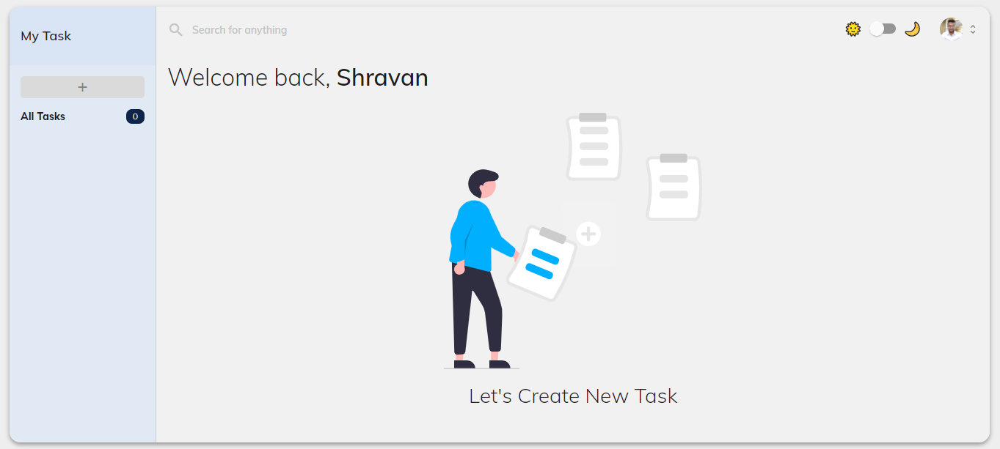
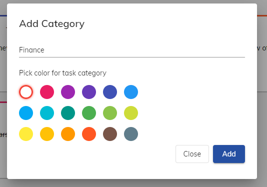
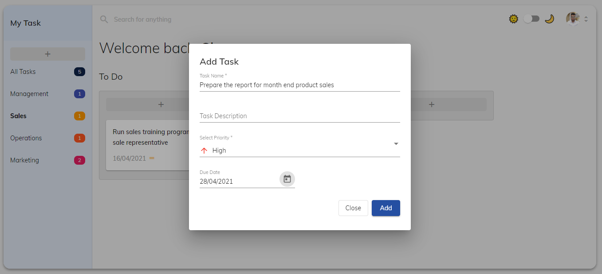
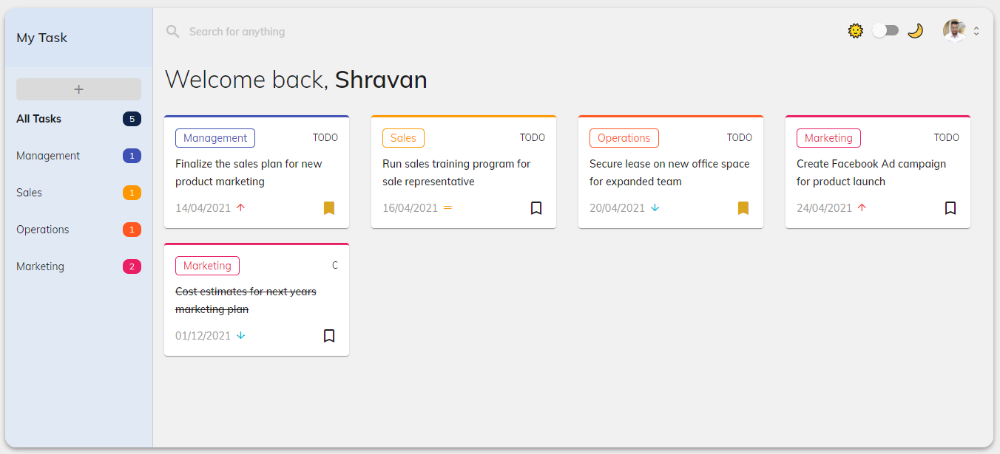
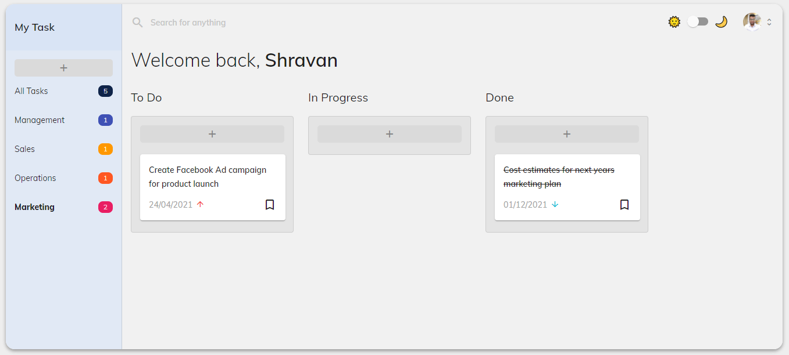
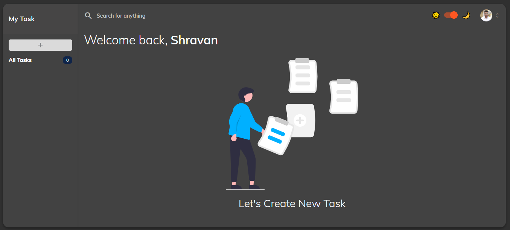
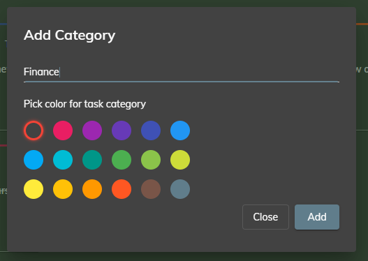
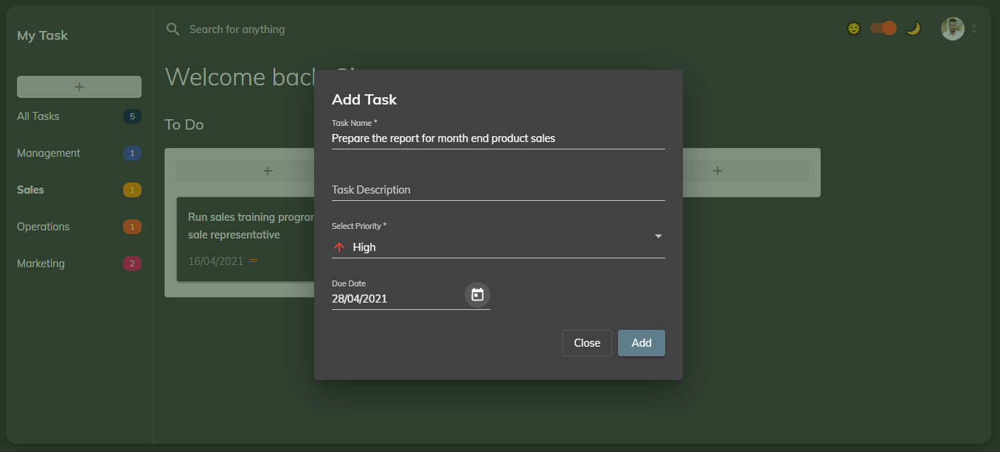
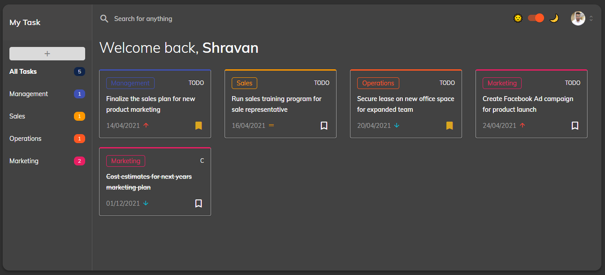
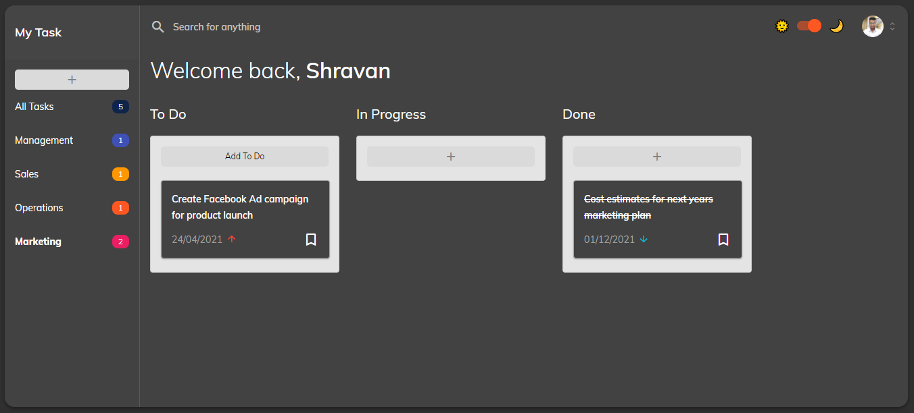

# angular-my-task-app
My Task App is a simple task application which helps user to create tasks according to categories. The app is bundled with following features:
  1. Light and Dark themes.
  2. Color picker for category.
  3. Add task under each defined category with description, priority, due date (Date picker).
  4. Move task between to-do, in progress and done status (kanban board).

Note: The app is currently in beta stage and all the state is managed by a dummy service. I will connect this with Firebase later. There are few things missing such as edit and delete a category, searching a task etc.

## App Designs - Light Theme

Start Page
 

 
Add Category
 

 
Add Task
 

 
All Task View
 

 
Kanban style Board
 

## App Designs - Dark Theme

Start Page
 

 
Add Category
 

 
Add Task
 

 
All Task View
 

 
Kanban style Board
 

